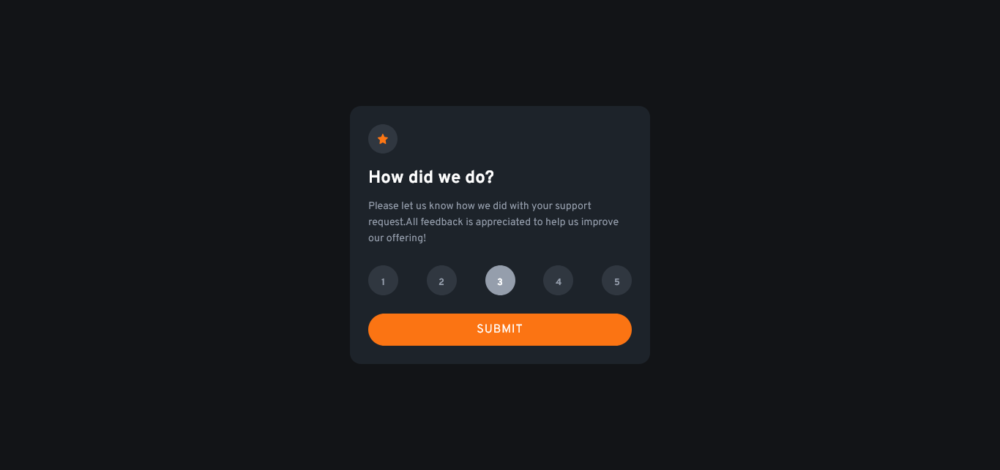

# Frontend Mentor - Interactive rating component solution

This is a solution to the [Interactive rating component solution](https://www.frontendmentor.io/challenges/interactive-rating-component-koxpeBUmI). Frontend Mentor challenges help you improve your coding skills by building realistic projects. 

## Table of contents

- [Overview](#overview)
  - [The challenge](#the-challenge)
  - [Screenshot](#screenshot)
  - [Links](#links)
- [My process](#my-process)
  - [Built with](#built-with)
- [Author](#author)

## Overview

### The challenge

Users should be able to:

- View the optimal layout depending on their device's screen size
- See hover states for interactive elements

### Screenshot

### Links

- Solution URL: https://github.com/thiagogrn/FM-N-interactive-rating-component
- Live Site URL: https://thiagogrn.github.io/FM-N-interactive-rating-component/

## My process

### Built with

- Semantic HTML5 markup
- CSS custom properties
- Vanilla JS
- SASS
- Flexbox
- Mobile-first workflow

## Author

- Frontend Mentor - https://www.frontendmentor.io/profile/thiagogrn
- Twitter - https://twitter.com/thiagogrn

